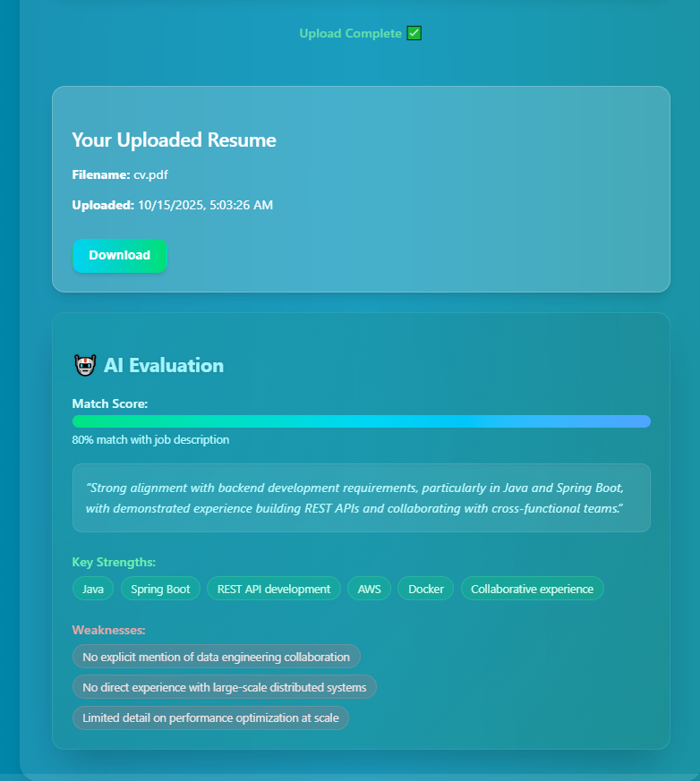
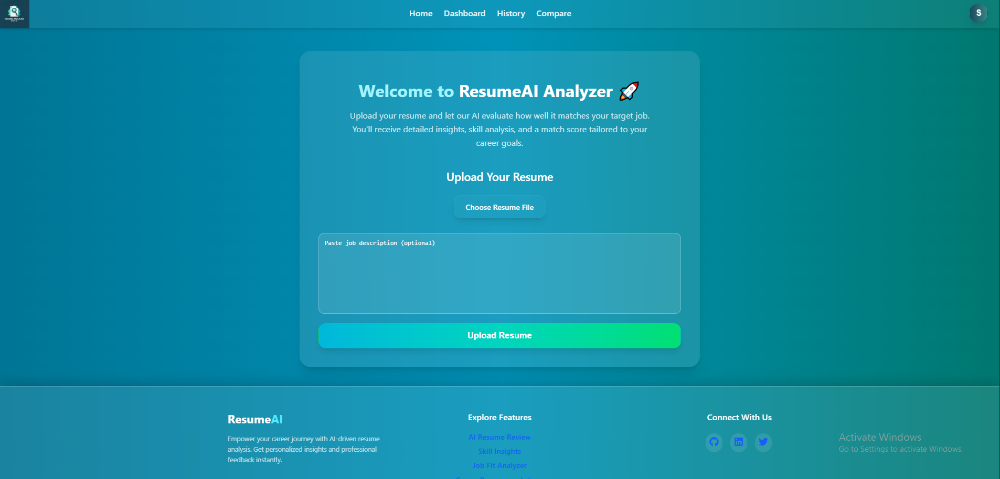
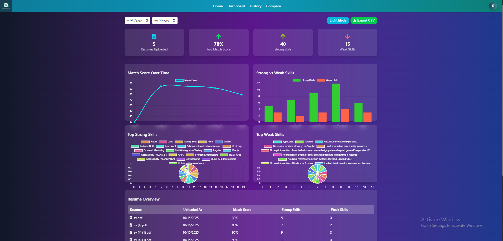
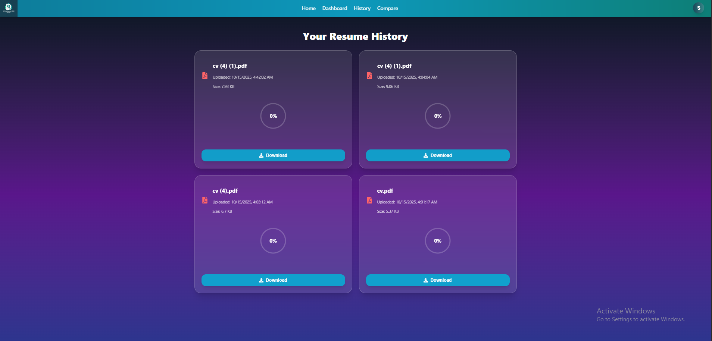
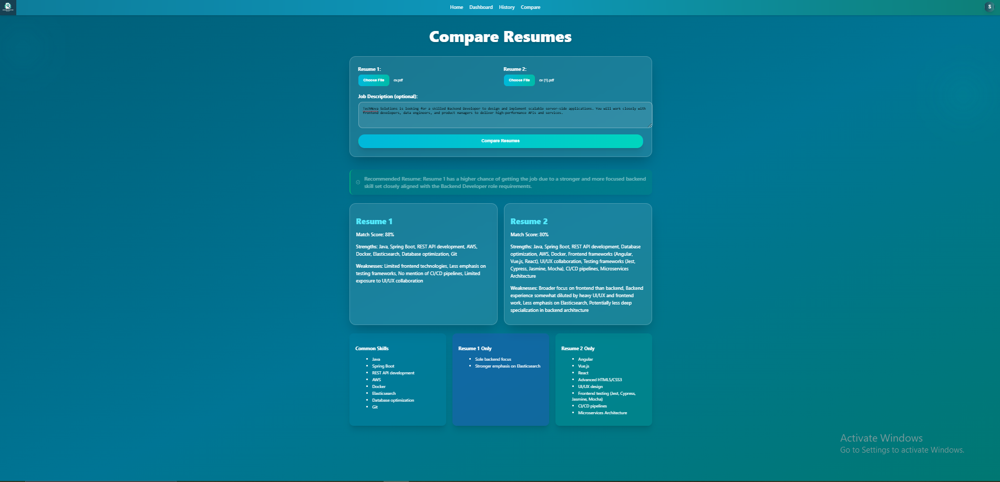

# AI Resume Analyzer Platform

AI Resume Analyzer is a cutting-edge web-based platform designed to help recruiters, HR professionals, and job seekers streamline the resume evaluation process. The platform leverages artificial intelligence to analyze uploaded resumes, calculate match scores against job descriptions, suggest improvements, and even compare multiple candidates to identify the best fit for a role.
Built with a **microservices architecture**, the platform ensures scalability, maintainability, and modularity. It integrates advanced search, cloud-style file storage, and AI-driven analysis to provide actionable insights for recruitment decisions.

---

## Key Features

- **Resume Analysis:** Upload PDFs to evaluate match against a job description, with AI-powered recommendations for improvement.  
- **Resume Comparison:** Compare two or more candidates to see who best fits a given role.  
- **Microservices Architecture:** Separate services for user management, analytics, and resume processing ensure modularity and scalability.  
- **File Management:** Resumes are securely stored using MinIO.  
- **Advanced Search:** ElasticSearch integration for fast, flexible resume searching and indexing.  
- **AI Integration:** Supports both OpenAI and Azure OpenAI models for intelligent recommendations and insights.  
- **Responsive UI:** Built with React and TailwindCSS for a smooth and intuitive experience.  
- **Security:** JWT authentication, OAuth2 support (Google, Twitter), and role-based access control.  

---

## Technology Stack

- **Frontend:** React, TypeScript, TailwindCSS, React Router, Axios  
- **Backend:** Spring Boot, Java, REST APIs, Microservices  
- **Database:** PostgreSQL  
- **File Storage:** MinIO  
- **Search & Indexing:** ElasticSearch  
- **AI & NLP:** OpenAI, Azure OpenAI  
- **Containerization:** Docker, Docker Compose  
- **Authentication & Security:** JWT, OAuth2 (Google & Twitter)  
- **File Handling:** Spring Boot multipart file upload

---
## Screenshots

  
